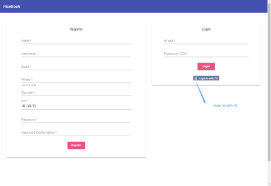
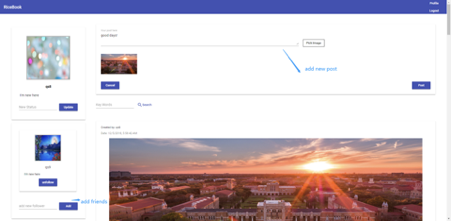

# RiceBook
**Facebook-like website for students to post blogs with
pictures and comment on blogs**

https://qs8-final-frontend.surge.sh

## Frontend
- built with **[Angular](https://angular.io/)**, implemented UI with  **[Angular Material](https://material.angular.io/)**  and
CSS framework.
- unit test with **[Karma](https://karma-runner.github.io)**, e2e test with **[Protractor](http://www.protractortest.org/)** 
- Deploy frontend app on **[Surge](https://surge.sh/)**

## Backend
- Constructed the RESTful API with with **[Node.js](https://nodejs.org/en/)** and **[Express.js](https://github.com/expressjs/express)**
- Using **[MongoDB](https://www.mongodb.com/)** for storage.
- Added **[Facebook third-party authentication](https://developers.facebook.com/)** with **[passport.js](http://www.passportjs.org/)** 
- unit test with **[isomorphic-fetch](https://www.npmjs.com/package/isomorphic-fetch)**
- Host backend server on **[Heroku](https://heroku.com/)**

## Preview

